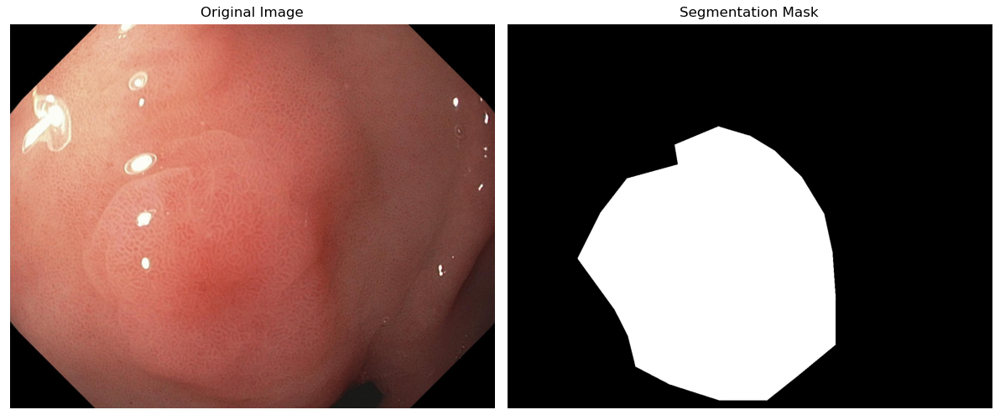
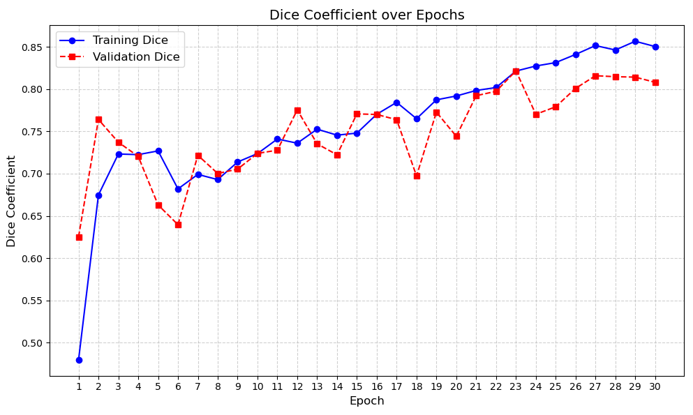
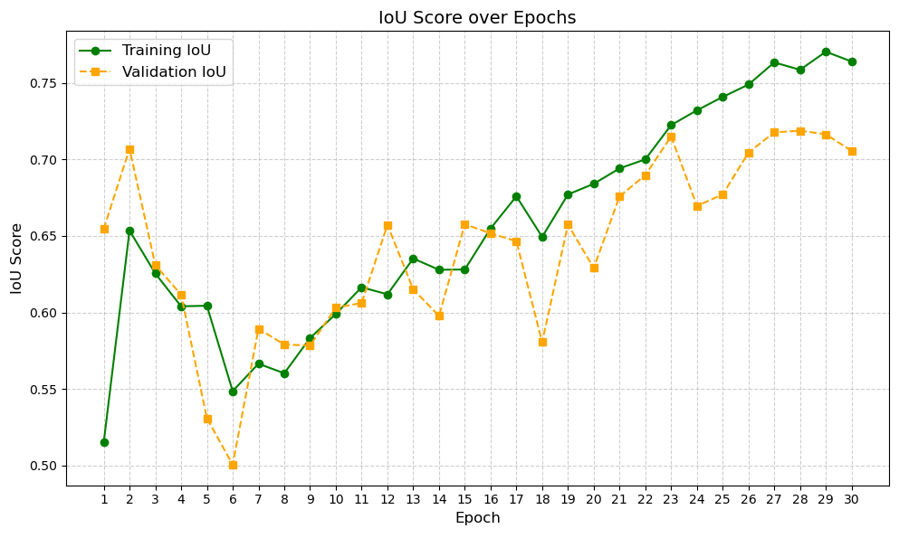
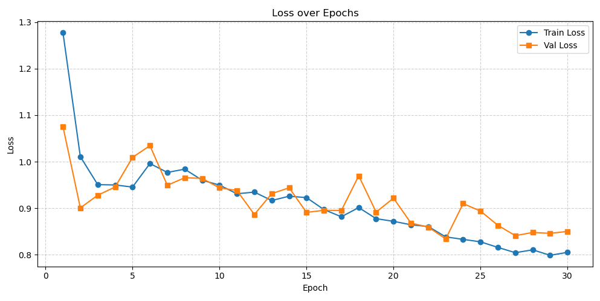
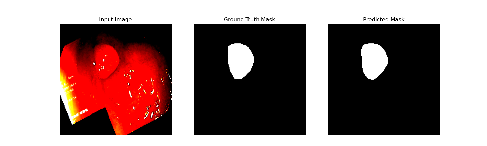

# Polyp Segmentation in Colonoscopy Images


## Project Overview

This repository contains an implementation of polyp segmentation in colonoscopy images using deep learning techniques. The project aims to improve colorectal cancer screening by automatically identifying and segmenting polyps from colonoscopy images.

[UNet++: A Nested U-Net Architecture for Medical Image Segmentation](https://arxiv.org/abs/1807.10165)

## U-Net++  Architecture

This project implements the U-Net++ architecture, a specialized convolutional neural network designed for biomedical image segmentation.


U-Net++ is an advanced deep learning architecture for image segmentation that builds on the original U-Net by incorporating nested and dense skip connections. This design improves feature fusion at different scales and helps reduce the semantic gap between the encoder and decoder, resulting in more precise segmentation, especially in complex applications like medical imaging.

U# Features of U-Net++

U-Net++ offers several distinctive features that improve segmentation performance:

### Nested Skip Connections
Instead of direct skip connections from encoder to decoder as in U-Net, U-Net++ introduces a series of nested, dense skip pathways that progressively refine feature maps.

### Deep Supervision
The architecture supports deep supervision by applying loss functions to intermediate outputs, which helps guide training and improves convergence.

### Reduced Semantic Gap
The nested structure helps bridge the semantic differences between low-level encoder features and high-level decoder features, leading to more precise segmentation.

### Multi-scale Feature Fusion
Multiple intermediate layers combine features at different scales, enhancing the model’s ability to capture fine details and context simultaneously.

### Improved Gradient Flow
The dense connections facilitate better gradient propagation during training, which can result in more stable and efficient learning.

### Flexibility
U-Net++ can be adapted to various segmentation tasks, including medical imaging, by adjusting the network depth and complexity according to the dataset.

## Dataset

This project utilizes the **Kvasir-SEG dataset**, a comprehensive collection of gastrointestinal polyp images with corresponding segmentation masks.
<br>
[link for data](https://datasets.simula.no/kvasir-seg/)
### Dataset Specifications

- **Content**: 1,000 polyp images with corresponding ground truth segmentation masks
- **Source**: Collected during real colonoscopy examinations
- **Format**:
  - Images: High-resolution RGB images in JPG format
  - Segmentation Masks: Binary masks in PNG format
- **Resolution**: Variable, predominantly 720×576 pixels
- **Annotations**: Pixel-level annotations by medical experts, verified by experienced endoscopists

## Evaluation Metrics

### Dice Coefficient (DICE)
- **Definition**: Measures overlap between two segmentation masks
- **Formula**: DICE = 2|A∩B|/(|A|+|B|) = 2TP/(2TP+FP+FN)
- **Range**: [0,1] where 1 indicates perfect overlap
- **Use case**: Commonly used in medical image segmentation; more sensitive to true positives

### Intersection over Union (IoU)
- **Definition**: Measures overlap divided by union of two segmentation masks
- **Formula**: IoU = |A∩B|/|A∪B| = TP/(TP+FP+FN)
- **Range**: [0,1] where 1 indicates perfect overlap
- **Use case**: Standard in computer vision benchmarks; more strictly penalizes errors


## VISUALIZATION OF IMAGE AND MASK



# Final Results 


# Final Results

| Metric     | Train   | Validation |
|------------|---------|-----------|
| **Loss**       | 0.8054  | 0.8133    |
| **DICE**       | 0.8503  | 0.8425    |
| **IoU**        | 0.7625  | 0.7422    |
| **Accuracy**   | 0.9514  | 0.9463    |
| **Precision**  | 0.8773  | 0.8741    |


## comparison of unet and unet++

# Comparison of Two Runs

| Metric     | Unet++ (Train) | Unet (Val) | Unet++ (Train) | Unet (Val) |
|------------|---------------|-------------|---------------|-------------|
| **Loss**       | 0.8054        | 0.8133      | 0.8118        | 0.8794      |
| **DICE**       | 0.8503        | 0.8425      | 0.8455        | 0.7858      |
| **IoU**        | 0.7625        | 0.7422      | 0.7552        | 0.6770      |
| **Accuracy**   | 0.9514        | 0.9463      | 0.9497        | 0.9314      |
| **Precision**  | 0.8773        | 0.8741      | 0.8574        | 0.8059      |



<br>
---


<br>
---


<br>
---

---
>The graph shows how the training loss and validation loss change over time as the model learns. In the first few epochs, both losses start high but decrease, meaning the model is improving. The training loss (blue) steadily decreases, while the validation loss (orange) fluctuates a bit but follows a similar trend.
>By the end of the training (epoch 30), both losses are close to 0.8, showing that the model has learned well and is not overfitting. The small gap between them indicates good generalization, meaning the model performs well on both training and unseen validation data.

----


## final visualisation 




 Hugging Face space for this model .
[hugging_face](https://huggingface.co/spaces/vighneshtensor/Polyp_Segmentation_-in-colonoscopy-images)

### setup 
## Prerequisites

Before you begin, ensure you have Python 3.7+ installed on your system.


 Installation Steps

Clone the repository
``` git clone https://github.com/yourusername/polyp-segmentation.git ```
<br>

Navigate to the project directory
<br>

```cd polyp-segmentation ```

Install dependencies

``` pip install -r requirements.txt ```


project Structure
```Md
app.py: Flask web application
main.py: Main entry point for the application
prev_train.py: Previous training script
unet_train/Unet.py: U-Net model implementation
onnx_main/export_onnx.py: Script for exporting models to ONNX format
utils/: Utility functions for prediction, plotting, and loss calculations
```
	

For Gradio interface 
```python
   python app.py
  ```
   ```The application will be available at http://localhost:port (give the correct port number ).```

### Run the main script
```Bash
python main.py
```

### Model Training

To train the U-Net model:  
```python
python main.py 
```

### ONNX Export
To export the trained model to ONNX format:
```python
python onnx_main/export_onnx.py
```


## Additional Information

>- For detailed documentation, refer to the README.md file
>- Make sure to check GPU compatibility if you're using PyTorch with CUDA

